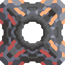
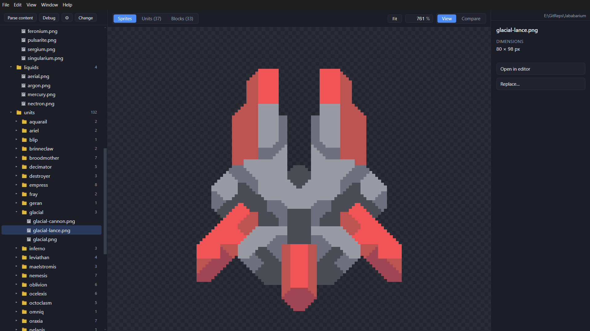

<div align="center">



# Curo

**A desktop sprite manager for Mindustry mods.**

Browse, preview, composite, and compare your mod's sprites - with live reload,
in-game unit/block previews, and one-click hand-off to your pixel editor.



</div>

> **Disclaimer:** Curo was built as a companion tool for developing my own
> Mindustry mod, so its features follow that mod's workflow and Java content
> style first. It should work with similar mods, but anything outside that
> scope is untested - feel free to open an issue.

## Features

- **Sprite browser** - pick a mod root, get a collapsible tree of its `sprites/`
  folder. Crisp nearest-neighbor preview with checkerboard and zoom.
- **Live reload** - edits on disk show up instantly; open a sprite directly in
  your image editor (e.g. Aseprite) or replace it with another PNG.
- **Content parsing** - scans your mod's Java content definitions and turns
  units and blocks into structured entries.
- **In-game composites** - units render base + cell (team-tinted) + weapons at
  their real positions, with mirror/top handling, missing-sprite markers, and a
  hitbox overlay matching Mindustry's `hitSize`. Turrets get their foundation
  plates.
- **Compare mode** - put the current sprite side-by-side or overlaid with up to
  6 reference sprites, with pixel/tile size readouts.

## Install (Windows)

1. Go to [Releases](https://github.com/Shroud-y/Curo/releases).
2. Download either:
   - `Curo-Setup-<version>.exe` — installer (recommended), or
   - `Curo-Portable-<version>.exe` — single portable executable, no install.
3. Run it. Windows SmartScreen may warn because the build is unsigned — choose
   **More info → Run anyway**.

## Build from source

Requirements: [Node.js](https://nodejs.org/) 20+ and [pnpm](https://pnpm.io/).

```bash
git clone https://github.com/Shroud-y/Curo.git
cd Curo
pnpm install
pnpm dev          # launch in dev mode (hot reload)
```

Other scripts:

```bash
pnpm typecheck    # tsc, strict, both configs
pnpm build        # bundle main + preload + renderer into out/
pnpm preview      # run the production bundle
pnpm dist:win     # package a Windows installer + portable exe into release/
```

## Usage

1. Launch → **Pick mod folder** → choose your Mindustry mod root (the folder
   that contains a `sprites/` subfolder).
2. Browse the sprite tree on the left; the center pane previews the selection.
3. **Parse content** to unlock the **Units** and **Blocks** tabs with in-game
   composite previews (team tint, weapons, hitbox, foundation plates).
4. **Compare** mode (top toolbar) puts the current sprite next to reference
   sprites you pick on the right.
5. ⚙ Settings: set your image editor for **Open in editor**.

## Project layout

- `src/main` — Electron main process: folder picking, sprite tree reads, file
  watching, and the Java content parser.
- `src/preload` — context-isolated bridge exposing `window.api`.
- `src/shared` — IPC channel names + shared types, imported by both sides.
- `src/renderer` — React UI: trees, composite renderers, compare view
  (`App.tsx` + components, pure layout math in `lib/`).

## License

MIT
